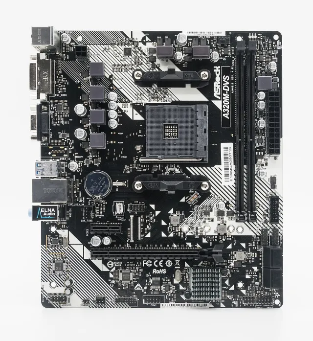
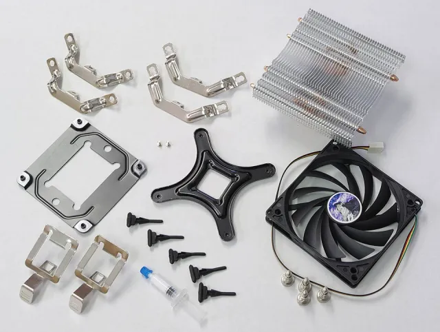
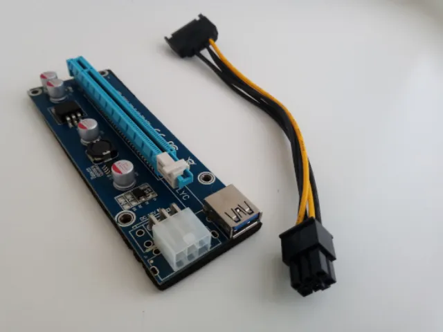
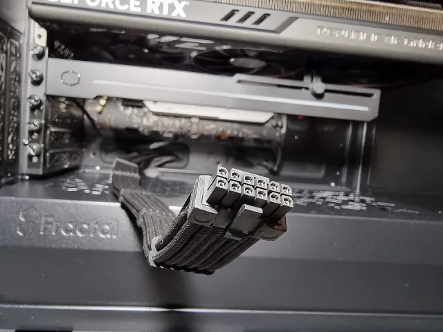
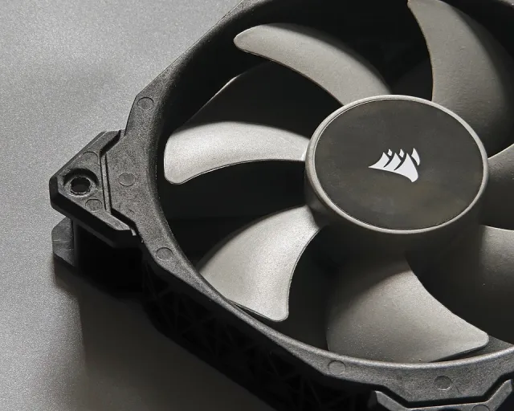
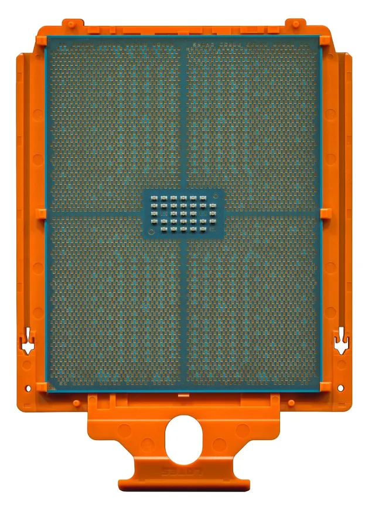
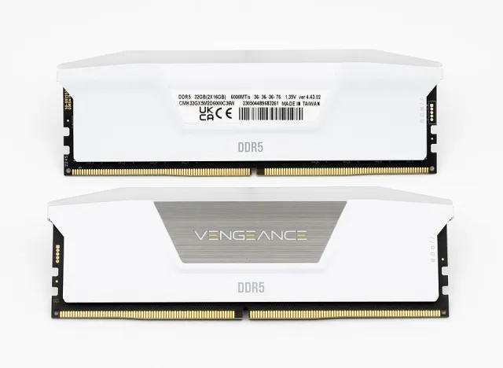
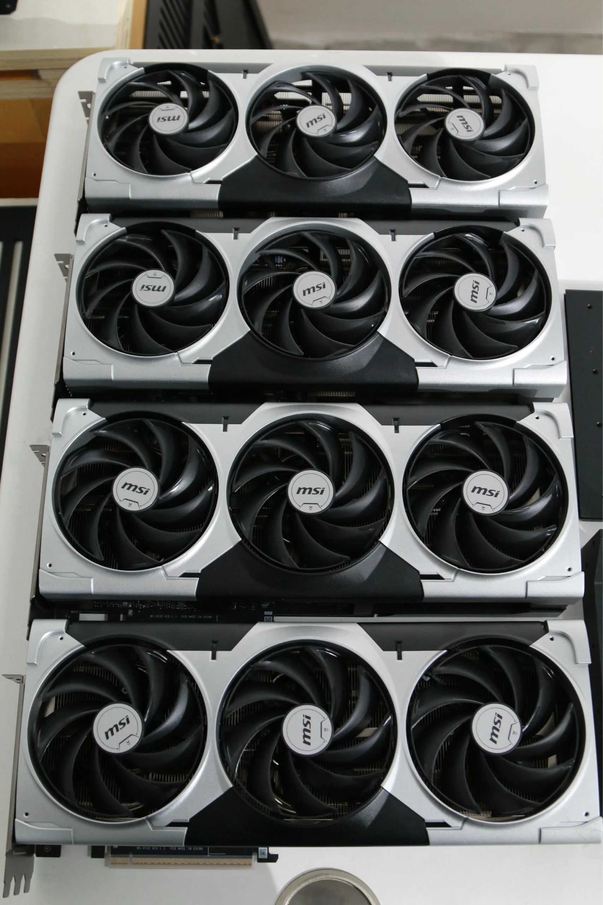
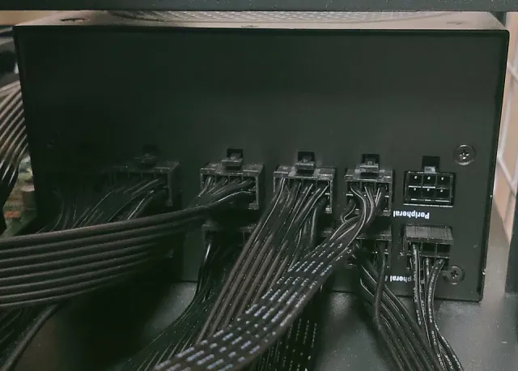
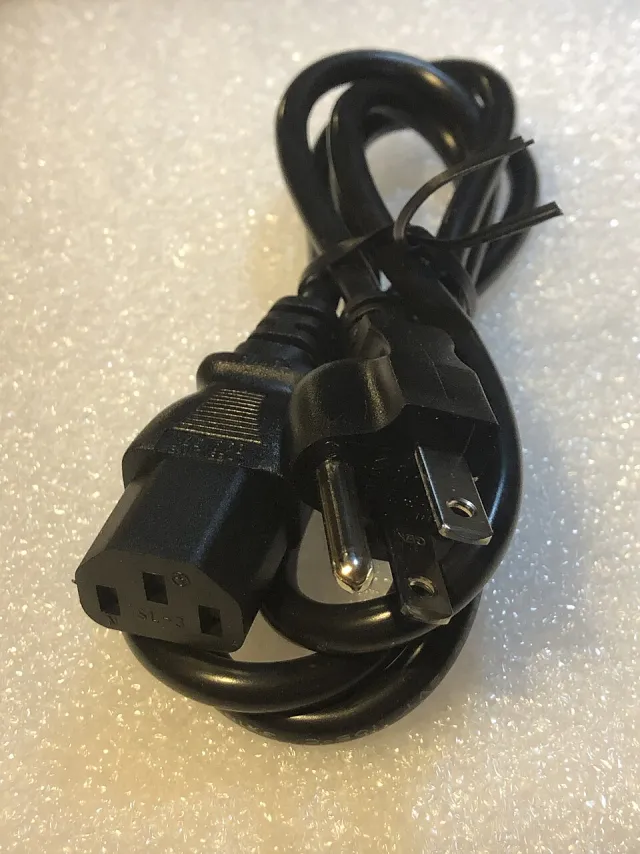

# Preparation — Electronic & Electrical

Every part in the [bill of materials](../bom/bom.md), photographed. Lay them all out before you start assembly.

> **Mostly representative product images — pending photos of the actual build** (the GPUs, item 6, are from this build). Exact models are being confirmed; see the BOM for the parts marked TBD.

<table>
    <tr>
        <td valign="top" align="center" width="50%">
            <b>1. Mainboard — AMD WRX90 (model TBD)</b> 
             
            <b>3. CPU heatsink — sTR5 cooler</b> 
             
            <b>5. SSD — 1 TB NVMe</b> 
             
            <b>7. PCIe 5.0 riser cable (×4)</b> 
             
            <b>9. GPU power cable — 12VHPWR (×4)</b> 
             
            <b>11. Fan (×4)</b> 
             
        </td>
        <td valign="top" align="center" width="50%">
            <b>2. CPU — AMD Ryzen Threadripper PRO</b> 
             
            <b>4. RAM — DDR5 96 GB</b> 
             
            <b>6. GPU — MSI GeForce RTX 5090 (×4)</b> 
             
            <b>8. PSU — 4000 W</b> 
             
            <b>10. Power cord</b> 
             
        </td>
    </tr>
</table>

Next: [assembly](assembly.md).
