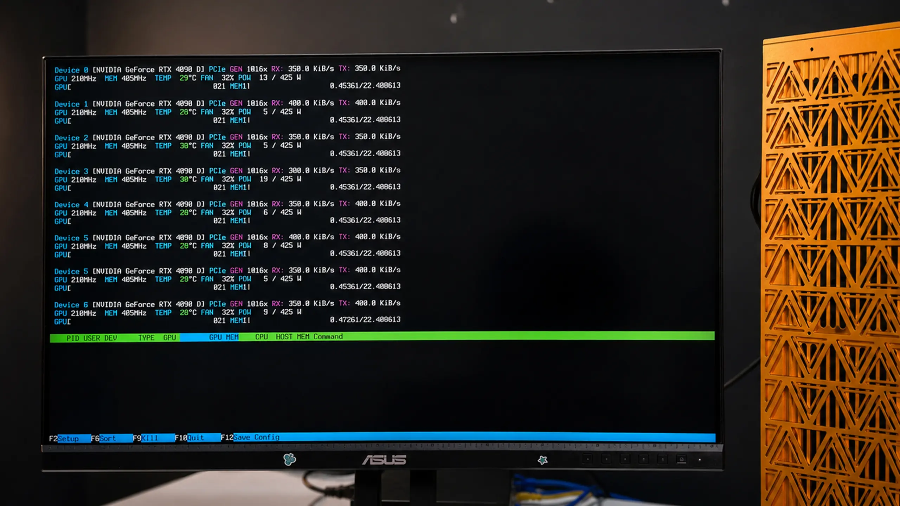

# BIOS tuning and GPU testing

Getting the machine ready and proving it works: BIOS tuning for multi-GPU, NVIDIA drivers, and hardware verification. Exact BIOS menu paths vary by motherboard — check your build's `docs/` and board manual for specifics.

## BIOS optimization for GPU performance

> The default BIOS settings rarely deliver full performance for multi-GPU workloads. Adjust these:

- **PCIe settings** — *Important.* Set all GPU slots to the highest supported speed (Gen4/Gen5) and configure bifurcation for your GPUs.
  ```
  Advanced -> Chipset Configuration -> PCIE link width -> set the MCIO pairs feeding the GPUs to x16
  ```
- **Above 4G Decoding** — *Important.* Enable so the platform can map the GPUs' large memory.
  ```
  Advanced -> PCI Subsystems Settings -> Enable Above 4G Decoding   (often on by default)
  ```
- **Resizable BAR** — *Important.* Enable for faster CPU↔GPU transfer.
  ```
  Advanced -> PCI Subsystems Settings -> Enable Re-size BAR support
  ```
- **Power management** — *Optional.* Disable power-saving features (C-states, ASPM) that can throttle GPUs.
- **Memory** — *Optional.* Run RAM at rated speed (enable XMP/EXPO) for max bandwidth.
- **Fans & thermals** — *Optional.* Set fan curves and thermal limits for sustained GPU load.

Save, reboot, and confirm stability.

## NVIDIA drivers + OS

- Install Linux (Ubuntu LTS is a safe default) or your OS of choice.
- Install the current NVIDIA driver and CUDA toolkit for your cards.
- Confirm the OS sees every GPU before going further — next section.

## GPU testing



Verify the hardware before you rely on it.

- **Fast hardware check:** boot **WinPE from USB** to confirm all cards enumerate, or
- **Linux check:** with drivers installed, run:
  ```bash
  nvidia-smi      # every GPU listed, correct VRAM, expected power/temp
  nvtop           # live per-GPU utilization and memory
  ```

Confirm:
- [ ] All GPUs appear in `nvidia-smi` (count matches your build: 2 / 4 / 8).
- [ ] Each card reports its full VRAM.
- [ ] PCIe link width/speed is what you set in BIOS (no cards dropped to x1/x4).
- [ ] Temperatures and power draw are sane at idle and under load.

Per-build testing screenshots live in each build's `photos/.../testing/`.

## Board manuals

Each build ships its motherboard and BMC manuals in its `docs/` folder. Use them for the exact menu locations on your board.
